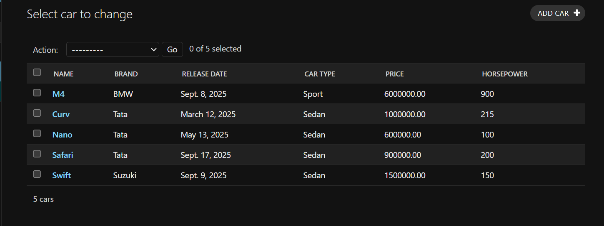

# Ex02 Django ORM Web Application
## Date: 

## AIM
To develop a Django application to store and retrieve data from a Movies Database using Object Relational Mapping(ORM).

## ENTITY RELATIONSHIP DIAGRAM


## DESIGN STEPS

### STEP 1:
Clone the problem from GitHub

### STEP 2:
Create a new app in Django project

### STEP 3:
Enter the code for admin.py and models.py

### STEP 4:
Execute Django admin and create details for 10 books

## PROGRAM
```
models.py
from django.db import models
from django.contrib import admin

class Car(models.Model):
    name = models.CharField(max_length=255, help_text="Car Name")
    brand = models.CharField(max_length=100, help_text="Car Brand")
    release_date = models.DateField(help_text="Release Date")
    car_type = models.CharField(max_length=50, help_text="Car Type (e.g., SUV, Sedan)")
    price = models.DecimalField(max_digits=10, decimal_places=2, help_text="Car Price (e.g., 1500000.00)")
    horsepower = models.IntegerField(help_text="Horsepower (e.g., 250)")

class CarAdmin(admin.ModelAdmin):
    list_display = ('name', 'brand', 'release_date', 'car_type', 'price', 'horsepower')

admin.py
from .models import Car, CarAdmin
from django.contrib import admin

admin.site.register(Car, CarAdmin)
```


## OUTPUT



## RESULT
Thus the program for creating movies database using ORM hass been executed successfully
